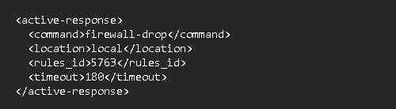
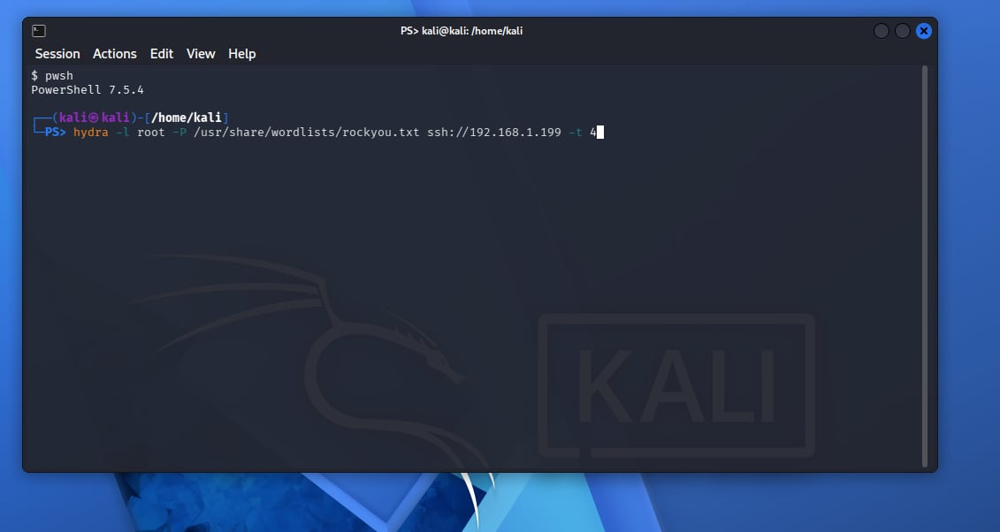
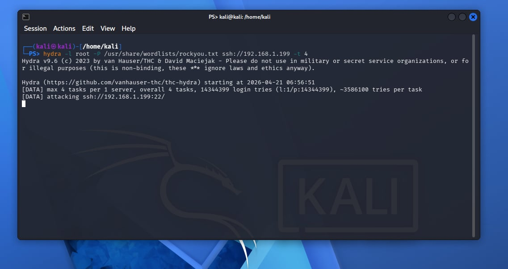
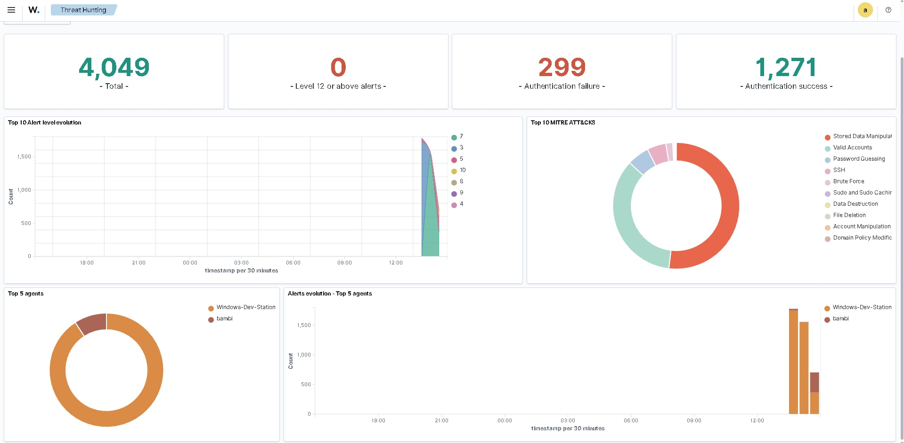
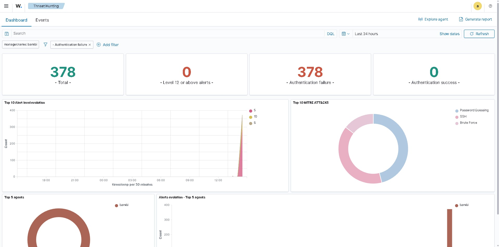
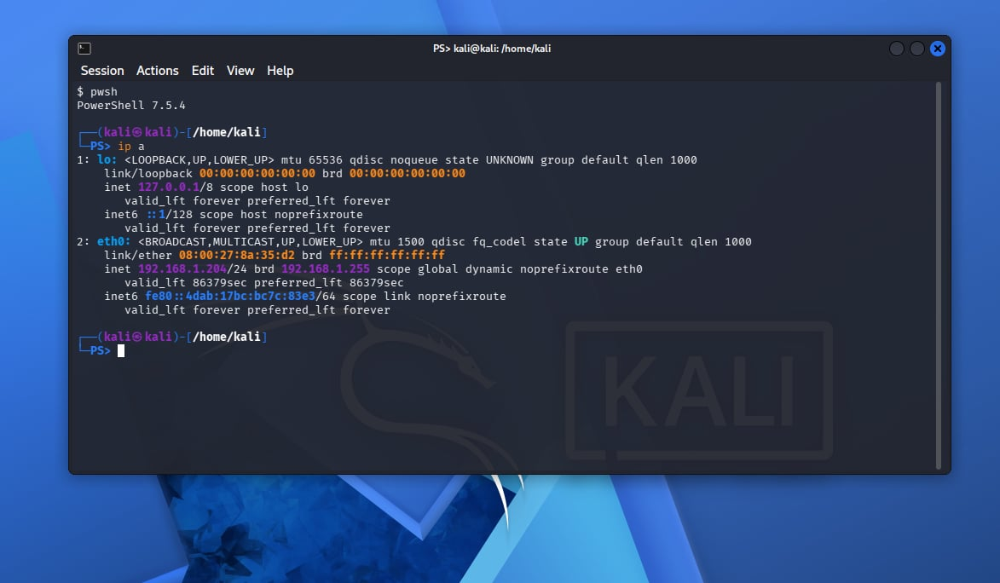
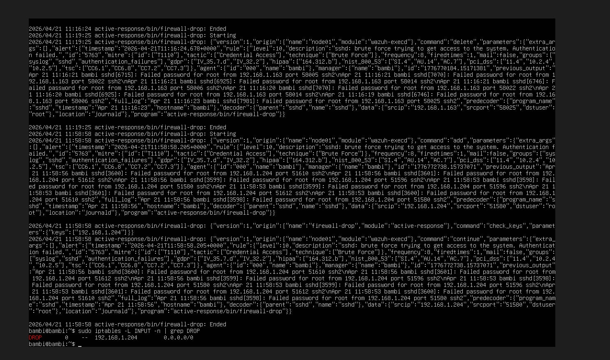

# 🛡️ Wazuh SIEM Lab – Intrusion Detection System with Active Response

> Hands-on lab that was created as part of my journey of learning.

---

## 📌 Project Overview

This project documents the use of **Wazuh** - Intrusion Detection System with Active Response. In this project, I've primarily focused on setting up **Intrusion Detection** and **Active Response** which is a detection capability that can be used to identify **brute-force** attempts to logins that were not known by the user.

In this lab, I've learned what kind of monitoring can popup when it comes to **brute-force**.

---

## 🎯 Objectives

- Simulate a real-world SSH brute force attack using Hydra on Kali Linux targeting an Ubuntu server.
- Configuring Wazuh's active response to automatically trigger a firewall block when an attack is detected.
- Detect brute force attack using Wazuh's built-in rule 5763.
- Verify that the attacker's IP was successfully blocked using iptables on the Ubuntu server.
- Monitor and analyze security alerts in real time through the Wazuh dashboard.

---

## 🧰 Tools & Technologies

| Tool | Purpose |
|------|---------|
| **Wazuh** | Open-source SIEM platform |
| **Wazuh Manager** | Central server for collecting and analyzing logs |
| **Wazuh Agent** | Installed on monitored endpoint |
| **Wazuh Dashboard** | Web UI for visualizing alerts and events |
| **VirtualBox / VMware** | Virtualization for lab environment |
| **Linux / Windows** | Operating systems used for endpoints |
| **Kali Linux** | Used as the attacker machine to simulate the SSH brute force attack |
| **Hydra** | Password cracking tool used to generate rapid SSH login attempts against the Ubuntu server |
| **iptables** | Linux firewall used by Wazuh's active response to automatically block the attacker's IP |
| **OpenSSH** | Enabled SSH access on the Ubuntu server as the attack surface for the simulation |
| **Wazuh Active Response** | Automated response module configured to trigger firewall-drop when rule 5763 fired |

---

## 🔧 Setup

### Step 1: Enable active response on Wazuh manager

> 

---

### Step 2: Simulate a brute-force attack - Kali Linux - Hydra

> Simulation
> 
> 

---

### Step 3: Check for detection on Wazuh

> Wazuh Threat Hunting
> 
> 

---

### Step 4: Check if attacker's IP was dropped

> Confirmation
> 
> 

---

## 🔍 Key Concepts Learned

- **Brute Force Attacks** - Understanding how attackers use automated tools like hydra to process different passwords to login until they gain access.
- **Intrusion Detection** - Learning how a SIEM like Wazuh monitors system logs in real time.
- **Active Response** - Understanding how security systems can automatically take action without human response.
- **SIEM Rule Thresholds** - Knowing how rule 5763 works by counting failed login attempts from the same IP within a time frame before triggering an alert.
- **iptables Firewall** - Understanding how Linux uses iptables to control incoming and outgoing network traffic and how DROP can be effective in discarding malicious  packets.
- **Network Segmentation** - Understanding the importance of having machines on the same network for proper communication in a lab.
- **Log Analysis** - Reading and understanding Wazuh's active-response logs and system alerts to verify that detection and response worked.
- **Attack Surface** - Understanding how SSH represents an exposed service that are commonly targeted.
- **Detection Response** - Understanding the workflow from an attack happening, being detected, and automatically dropped without manual intervention

---
